# React là gì? Tại sao lại chọn React?

ReactJs là một framework Javascript dùng để xây dựng các Single Page Application (SPA)

SPA là những trang web mà không bị reload khi chúng ta chuyển trang. Ví dụ: Facebook, Twitter, Instagram, Youtube, Gmail,...

Ngoài React thì còn có rất nhiều JS Framework có thể tạo được SPA như Angular,...

SPA tăng trải nghiệm người dùng vì không phải tải lại toàn bộ trang
SPA giúp phân chia rõ ràng code giữa frontend và backend => phát triển dễ dàng

1. **Thực hiện dự án Google Maps App:**

   - Cài đặt Create React App:

   ```bash
   npx create-react-app google-maps-app
   cd google-maps-app
   ```

   - Chạy ứng dụng React:

   ```bash
   npm start
   ```

   Chạy ứng dụng và truy cập vào [http://localhost:3000](http://localhost:3000) để xem trình duyệt chạy ứng dụng của bạn.

   - Cài đặt maps/api:

   ```bash
   npm install @react-google-maps/api
   ```

   Lấy keyApiMap để map hoạt động. Truy cập vào [trang](https://mapsplatform.google.com/) để tạo dự án và lấy API key map. Sau đó làm các bước sau:

   - Nhấn vào dự án vừa tạo.
     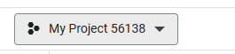
   - Nhấn vào nút menu 3 gạch ngang.
     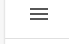

   - Chọn tab APIs & Services và vào Credentials.
     
   - Chọn loại giấy mô tả phù hợp để sử dụng.
     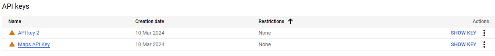
   - Nhấn chọn vào API key để hiển thị cửa sổ API key.

 #### Code thực hiện project:

- **Cài đặt Create React App:**

  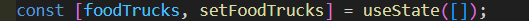

- **useState hooks:**
  - `foodTrucks`: được khởi tạo là một mảng rỗng `[]`.
  - `setFoodTrucks`: được sử dụng để thay đổi giá trị của mảng `foodTrucks`.

  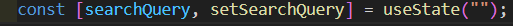

- **useState hooks:**
  - `searchQuery`: được khởi tạo là một chuỗi rỗng `""`.
  - `setSearchQuery`: được sử dụng để thay đổi giá trị của `searchQuery`.

  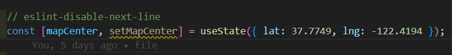

- **useState hooks:**
  - `mapCenter`: lưu trữ mặc định trung tâm của thành phố `{ lat: 37.7749, lng: -122.4194 }`.
  - `setMapCenter`: được sử dụng để thay đổi giá trị của `mapCenter`.

  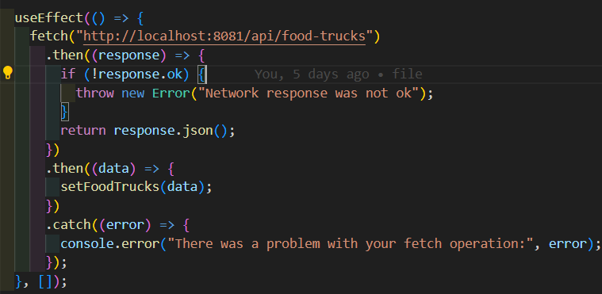

- **Sử dụng useState hook để gọi API:**
  - Đây là cách sử dụng hook useState để gọi API.
  - Hai hàm này đều sử dụng fetch API để nhận dữ liệu JSON từ backend để hiển thị.

  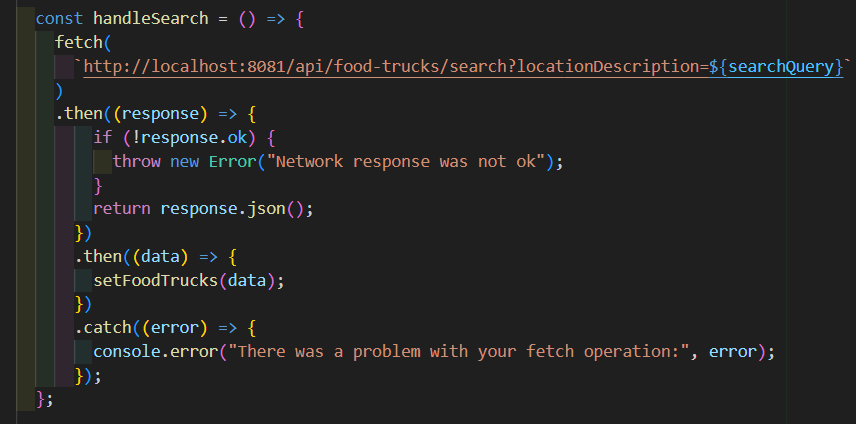

- **Hàm để gọi API và xử lý sự kiện từ input:**
  - Dùng `onClick` để bắt sự kiện từ input.
  - Dùng `onChange` để thay đổi giá trị mà không gây ra lỗi.

  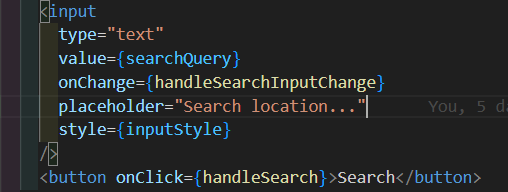

- **Load và hiển thị dữ liệu từ API:**
  - Sử dụng `map()` để lặp qua mảng và hiển thị dữ liệu từ API tương ứng.

  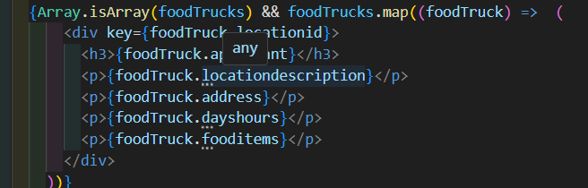

- **LoadScript, GoogleMap, Marker:**
  - `LoadScript` được sử dụng để sử dụng các tính năng của Google Maps API.
  - `GoogleMap` được sử dụng để tạo và tùy chỉnh bản đồ Google trên trang web.
  - `Marker` là một đối tượng hoặc biểu tượng được hiển thị trên bản đồ Google để chỉ định vị trí cụ thể.

  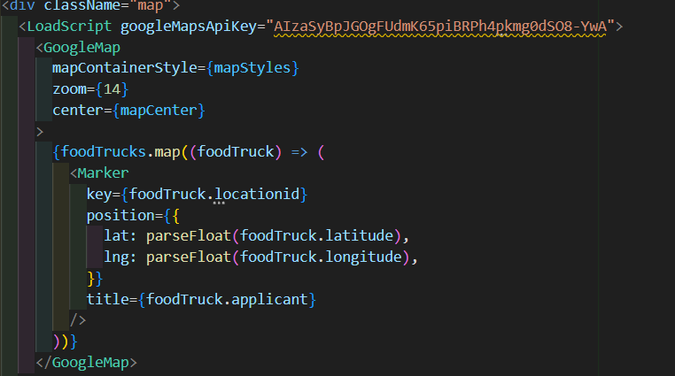

- **Truyền API key lấy được từ trên:**
  - Đây là cách truyền key API lấy được từ bước trước.

- **Sử dụng `map()` để lặp qua mảng phương thức và hiển thị các Marker tương ứng từ API.**


2. **Cách triển khai React JS với AWS EC2 (.pem For use with OpenSSH):**

   - **Tạo và cấu hình máy chủ EC2:**

     - Instances
     - Launch an instance (để tạo key)
     - Name and tags (e.g My Web server)
     - Application and OS Images (Amazon Machine Image) chọn Amazon Machine Image (AMI)
     - Instance type t2.micro
     - Key pair (login ) Info -> .pem For use with OpenSSH .ppk For use with PuTTY (Download OpenSSH, PuTTY để có thể đẩy code lên máy)
     - Network settings -> để nguyên hoặc cấu hình
     - Configure storage -> để nguyên hoặc cấu hình
     - Advanced details -> để nguyên hoặc cấu hình

   - **Đẩy code lên máy ảo:**
     - Đưa code của ứng dụng React lên máy chủ EC2 bằng cách clone git repository.
     - Chạy lệnh npm install để cài đặt các phụ thuộc.
     - Chạy lệnh npm run build để build ứng dụng React. Điều này sẽ tạo ra các tệp tĩnh trong thư mục build.
     - Chạy ứng dụng trên máy ảo.
     - Truy cập vào lại Instances chọn Instance ID tương ứng có Public IPv4 address hoặc Public IPv4 DNS kết hợp với API tương ứng (eg. http://54.251.142.187:8081/api/food-trucks or ec2-13-212-117-39.ap-southeast-1.compute.amazonaws.com:8081/api/food-trucks).

###

- [GitHub back_end_foodStuckfind](https://github.com/thienc45/back_end_foodStuckfind.git)

- [GitHub font_end_foodStuckfind](https://github.com/thienc45/font_end_foodStuckFind.git)

- [Video demo foodStuckfind](https://1drv.ms/v/s!AvdQFkUv6DA8oC1112avAniNuWEr?e=TsuKnS)

# Getting Started with Create React App

This project was bootstrapped with [Create React App](https://github.com/facebook/create-react-app).

## Available Scripts

In the project directory, you can run:

### `npm start`

Runs the app in the development mode.\
Open [http://localhost:3000](http://localhost:3000) to view it in your browser.

The page will reload when you make changes.\
You may also see any lint errors in the console.

### `npm test`

Launches the test runner in the interactive watch mode.\
See the section about [running tests](https://facebook.github.io/create-react-app/docs/running-tests) for more information.

### `npm run build`

Builds the app for production to the `build` folder.\
It correctly bundles React in production mode and optimizes the build for the best performance.

The build is minified and the filenames include the hashes.\
Your app is ready to be deployed!

See the section about [deployment](https://facebook.github.io/create-react-app/docs/deployment) for more information.

### `npm run eject`

**Note: this is a one-way operation. Once you `eject`, you can't go back!**

If you aren't satisfied with the build tool and configuration choices, you can `eject` at any time. This command will remove the single build dependency from your project.

Instead, it will copy all the configuration files and the transitive dependencies (webpack, Babel, ESLint, etc) right into your project so you have full control over them. All of the commands except `eject` will still work, but they will point to the copied scripts so you can tweak them. At this point you're on your own.

You don't have to ever use `eject`. The curated feature set is suitable for small and middle deployments, and you shouldn't feel obligated to use this feature. However we understand that this tool wouldn't be useful if you couldn't customize it when you are ready for it.

## Learn More

You can learn more in the [Create React App documentation](https://facebook.github.io/create-react-app/docs/getting-started).

To learn React, check out the [React documentation](https://reactjs.org/).

### Code Splitting

This section has moved here: [https://facebook.github.io/create-react-app/docs/code-splitting](https://facebook.github.io/create-react-app/docs/code-splitting)

### Analyzing the Bundle Size

This section has moved here: [https://facebook.github.io/create-react-app/docs/analyzing-the-bundle-size](https://facebook.github.io/create-react-app/docs/analyzing-the-bundle-size)

### Making a Progressive Web App

This section has moved here: [https://facebook.github.io/create-react-app/docs/making-a-progressive-web-app](https://facebook.github.io/create-react-app/docs/making-a-progressive-web-app)

### Advanced Configuration

This section has moved here: [https://facebook.github.io/create-react-app/docs/advanced-configuration](https://facebook.github.io/create-react-app/docs/advanced-configuration)

### Deployment

This section has moved here: [https://facebook.github.io/create-react-app/docs/deployment](https://facebook.github.io/create-react-app/docs/deployment)

### `npm run build` fails to minify

This section has moved here: [https://facebook.github.io/create-react-app/docs/troubleshooting#npm-run-build-fails-to-minify](https://facebook.github.io/create-react-app/docs/troubleshooting#npm-run-build-fails-to-minify)

# font_end_findtruckfood
